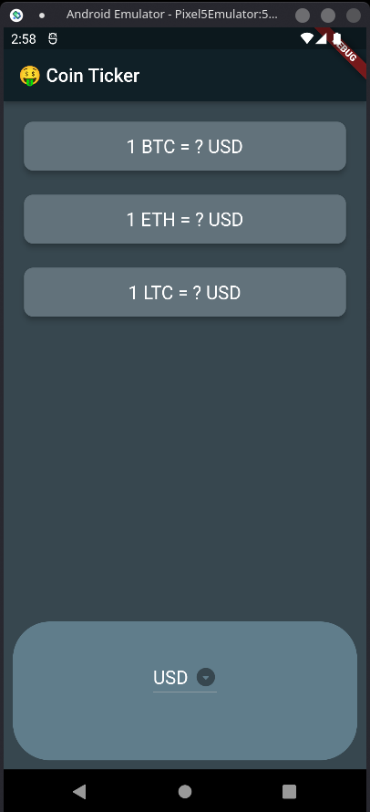
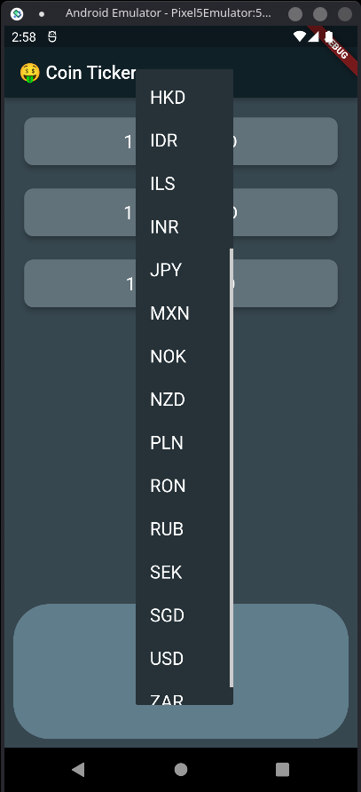
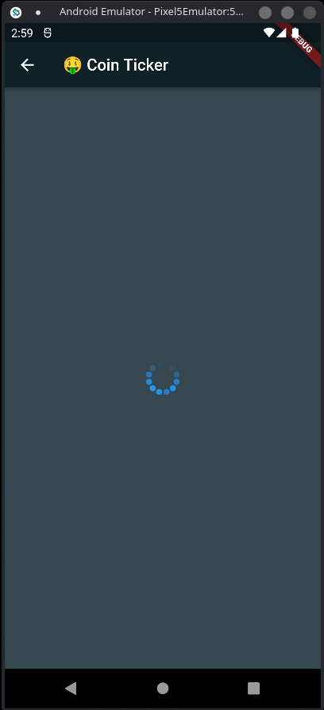
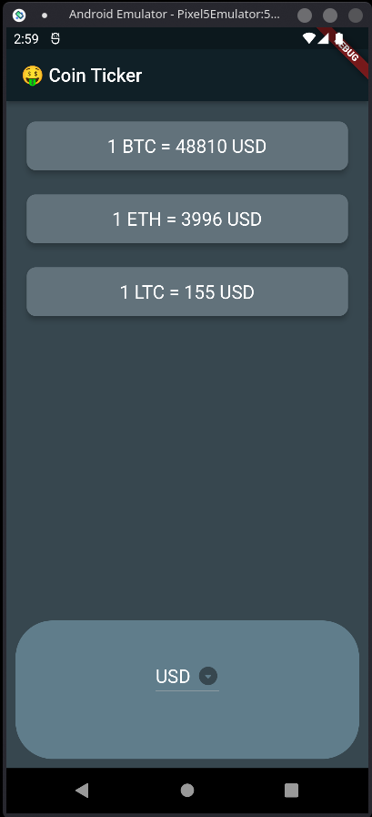

## About

This project is written completely in Dart & Flutter. The app will basically provide you the real time value of three major cryptocurrencies namely Bitcoin, Ethereum and Litecoin in your favourite currency.

The project uses the [COINAPI](https://www.coinapi.io/) to fetch all the real time values. You can access the API Dcomuentation from below :  
[API Documentation](https://docs.coinapi.io/).

## Getting Started

### Prerequisites

Make sure you have the Flutter SDK downloaded and setup. You can use the official documentation to setup flutter on your device :  
https://docs.flutter.dev/get-started/install
 You can setup flutter on Windows, Mac, Linux as well as Chrome OS.

### Running the App

Once you have Flutter Setup on your machine, go ahead and clone this repository on your local machine, and open the project folder on your choice of text editor.
(Android Studio & VSCode are both officially supported by the flutter team)
  Next, go ahead and play with flutter, customise the app to your liking, or try to add some more functionality if you want to...!!

## Screenshots

</img>
</img>
  
</img>
</img>

*Feel free to tap on images to view them in full resolution*

## Note
1. Am using the free trial of Coinapi for the ApiKey which allows only about 100 api fetch requests, so make sure if you clone the repo, you make a free account on coinapi and get your own apiKey and replace it with mine from "/lib/networking.dart"
 [Replace the ApiKey in this line.](https://github.com/ashuk1109/Flutter_BitcoinTicker_App/blob/main/lib/networking.dart#L8) 
*If you dont do this, you will get stuck on the spinner page for eternity as the app wont be able to fetch the desired info from the server!!*

2. This Project was essentially a Challenge/Assignment for one of the courses on Udemy, I have just customised it to my liking, you can do the same as per yours.
  [Course Link :](https://www.udemy.com/course/flutter-bootcamp-with-dart/) (Refer the section - Boss Level Challenge 3 for the Assignment info)

3. Feel free to post any issues (if found) or PR (Pull Requests) in this repository.

  
For any help regarding getting started with Flutter, view the
[online documentation](https://flutter.dev/docs), which offers tutorials,
samples, guidance on mobile development, and a full API reference.

